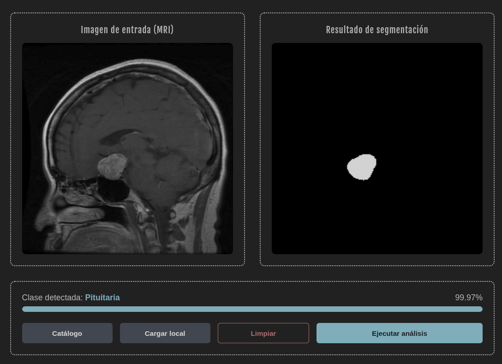

# Clasificador y segmentador de tumores cerebrales

## Descripción

Este proyecto implementa un sistema basado en inteligencia artificial para la clasificación y segmentación de tumores cerebrales a partir de imágenes de resonancia magnética (MRI).

El modelo de clasificación es capaz de identificar cuatro estados clínicos:

- Sano
- Glioma
- Meningioma
- Tumor de pituitaria

Además, el sistema genera una máscara de segmentación que localiza visualmente la región del tumor dentro de la imagen.

---

# Arquitectura del proyecto

Las redes neuronales fueron desarrolladas utilizando técnicas de transfer learning y fine-tuning, permitiendo obtener mejores métricas de desempeño y reducir considerablemente el tiempo de entrenamiento.

## Clasificación

- Backbone: ResNet50
- Clasificador: Perceptrón multicapa (MLP)

## Segmentación

- Arquitectura: U-Net
- Encoder: EfficientNet

---

# Conjunto de datos

Se emplearon dos datasets independientes para mejorar la capacidad de generalización del sistema.

## Clasificación

**Brain Tumor MRI Data**

https://www.kaggle.com/datasets/tombackert/brain-tumor-mri-data

División del conjunto de datos:

- 70% Entrenamiento
- 15% Validación
- 15% Prueba

---

## Segmentación

**Brain Tumor Segmentation Dataset**

https://www.kaggle.com/datasets/atikaakter11/brain-tumor-segmentation-dataset

Este conjunto incluye:

- Imágenes MRI
- Máscaras binarias (Ground Truth)

Las máscaras permiten que la red aprenda la morfología exacta del tumor.

---

<div align="center">


**Figura 1.** Ejemplo de una resonancia magnética cerebral.

</div>

---

# Despliegue

El proyecto se encuentra contenido con Docker, permitiendo ejecutar tanto el frontend como el backend mediante un único comando.

## Arquitectura

- Frontend → React
- Backend → FastAPI
- Modelos → ONNX Runtime
- Contenedores → Docker Compose

> **Nota:** Los modelos `.onnx` no se almacenan dentro del repositorio. Durante el arranque del contenedor del backend se descargan automáticamente desde **Hugging Face Hub**, para mantener la imagen ligera.

---

# Requisitos

- Docker
- Docker Compose

---

# Ejecución

## 1. Clonar el repositorio

```bash
git clone https://github.com/Rackzo-AyEl/clasificador_tumores.git
cd clasificador_tumores
```

## 2. Construir los contenedores

La primera ejecución descargará los modelos desde Hugging Face, por lo que puede demorar en iniciar la primera vez.

```bash
docker compose up --build
```

---

## Acceder a la aplicación

Una vez iniciado el sistema:

| Servicio | Dirección |
|----------|-----------|
| Frontend | http://localhost:3000 |
| Swagger UI | http://localhost:8000/docs |

---

## Reiniciar posteriormente

```bash
docker compose up
```

---

## Detener el sistema

```bash
docker compose down
```

---

# Estructura del proyecto

```text
Clasificacion_tumores/
│
├── Entrenamiento/
│   ├── notebooks/
│   ├── entrenamiento_clasificacion/
│   └── entrenamiento_segmentacion/
│
├── backend/
│   ├── app/
│   ├── modelos/
│   ├── Dockerfile
│   └── requirements.txt
│
├── frontend/
│   ├── src/
│   ├── public/
│   ├── Dockerfile
│   └── package.json
│
├── docker-compose.yml
├── README.md
└── .gitignore
```

---

# Flujo del sistema

```text
                 MRI
                  │
                  ▼
        ┌─────────────────┐
        │    Frontend     │
        │      React      │
        └────────┬────────┘
                 │
                 ▼
        ┌─────────────────┐
        │ FastAPI Backend │
        └────────┬────────┘
                 │
        ┌────────┴────────┐
        ▼                 ▼
 Clasificación      Segmentación
 (ResNet50+MLP)     (U-Net + EfficientNet)
        │                 │
        └────────┬────────┘
                 ▼
        Resultado + Máscara
```

---

# Captura de Ejecución



---

# Características

- Clasificación de tumores cerebrales en cuatro clases.
- Segmentación automática del tumor.
- Transfer Learning y Fine-Tuning.
- Inferencia acelerada mediante ONNX Runtime.
- Backend desarrollado con FastAPI.
- Frontend desarrollado en React.
- Contenedorización completa con Docker.
- Descarga automática de modelos desde Hugging Face.

---

Proyecto desarrollado con fines de investigación y aprendizaje en visión computacional aplicada al análisis de imágenes médicas.
